# MELFA CR800 Communication Protocol Reference (RT ToolBox3 Reverse-Engineered)

This document provides a detailed, packet-level specification of the communication protocol used between Mitsubishi Electric CR800 Series Robot Controllers (MELFA series) and the official **RT ToolBox3** programming software.

---

## 1. Connection Handshake (Two-Phase Protocol)

Communication consists of two distinct phases:
1. **Plaintext Handshake Phase**: Establishes initial TCP socket connection and negotiates protocol mode.
2. **HC-Framed Binary Phase**: Executes engineering commands, directory parsing, and file reads.

### Handshake Sequence Diagram

```mermaid
sequenceDiagram
    autonumber
    participant PC as PC (RT ToolBox3 / Script)
    participant Robot as CR800 Controller (Port 10001/10002)

    Note over PC, Robot: Plaintext Handshake Phase
    PC->>Robot: 1;1;OPEN=TOOLBOX\r\n
    Robot-->>PC: QoK3F;3F;7,0;... (controller_info)
    PC->>Robot: 1;1;CHGPRT=HC\r\n
    Robot-->>PC: QoK\r\n

    Note over PC, Robot: HC-Framed Binary Phase
    PC->>Robot: [STX]HC000000001R00141;1;OPEN=TOOLBOX;ENG[checksum][ETX]
    Robot-->>PC: [STX]HC000000001A000200[checksum][ETX] (Control ACK)
    Robot-->>PC: [STX]HC000000001D0052QoK...[checksum][ETX] (Data Response)
    Note over PC, Robot: Connection established in engineering/backup mode
```

---

## 2. HC Frame Structures

HC framing wraps ASCII payloads inside standard header and trailer bytes, adding sequence numbers, frame type indicators, length fields, and XOR-based checksums.

### A. Request Frame Format (PC to Robot)
```
[STX]HC{seq_num}R{payload_len}{payload}{checksum}[ETX]
```

| Field Name | Type / Format | Length (Bytes) | Description | Example |
| :--- | :--- | :--- | :--- | :--- |
| **Prefix** | ASCII Control | 1 | Start of Text (STX, `\x02` / `0x02`) | `\x02` |
| **Header ID** | Literal | 2 | Identifies the frame protocol | `HC` |
| **Sequence** | Decimal ASCII | 9 | Sequentially incremented message ID | `000000001` |
| **Msg Type** | Literal | 1 | `R` designates a Request | `R` |
| **Length** | Hex ASCII | 4 | Hexadecimal length of the `payload` string | `0014` (20 bytes) |
| **Payload** | ASCII | Var | The actual robot command payload | `1;1;OPEN=TOOLBOX;ENG` |
| **Checksum** | Hex ASCII | 2 | XOR-based verification checksum | `7A` |
| **Suffix** | ASCII Control | 1 | End of Text (ETX, `\x03` / `0x03`) | `\x03` |

### B. Control ACK Response Frame Format (Robot to PC)
When the robot receives a Request frame, it immediately responds with a fixed 22-byte Control ACK frame:
```
[STX]HC{seq_num}A000200{checksum}[ETX]
```
* **Msg Type:** `A` indicates an Acknowledgment/Control frame.
* **Payload Length:** `0002` (2 bytes).
* **Payload:** `00` (system control acknowledgment code).
* **Length:** Exactly 22 bytes.

### C. Data Response Frame Format (Robot to PC)
The robot's data response frame follows the ACK frame and returns the command output payload:
```
[STX]HC{seq_num}D{payload_len}QoK{payload}{checksum}[ETX]
```
* **Msg Type:** `D` indicates a Data frame.
* **QoK / QeR:** Successful commands return `QoK` followed by the response payload. Unsuccessful commands return `QeR` followed by an error code.

---

## 3. Checksum Calculation Algorithm

The 2-character hex checksum is calculated as the bitwise XOR of every character in the string formed by joining the Header ID (`HC`), Sequence Number, Message Type (`R`/`A`/`D`), Payload Length, and the Payload.

### Algorithm (Python):
```python
def calculate_hc_checksum(seq_str: str, msg_type: str, len_str: str, payload: str) -> str:
    chk_input = f"HC{seq_str}{msg_type}{len_str}{payload}"
    checksum = 0
    for char in chk_input:
        checksum ^= ord(char)
    return f"{checksum:02X}"
```

---

## 4. Directory Query Specifications

### A. Program Directory Listing (`PDIR`)
Used when backing up user programs (`type: "code"`):
* **Page 0 (First page):** `1;1;PDIR` (no suffix)
* **Pages 1+ (Subsequent pages):** `1;1;PDIR{page_hex:02X}` (hex-based suffix: `PDIR01` ... `PDIRFF`)
* **End of List:** Returns `QoK` (empty payload) when pages are exhausted.
* **Payload Layout:**
  `{filename};{attribute_or_crc};{datetime};{field3};{field4};{line_count};{edit_count}`

### B. Filesystem Directory Listing (`FDIR`)
Used when backing up all files or parameters (`type: "full"` or `type: "parameters"`):
* **Page 0 (First page):** `1;1;FDIR<{area}`
  * Suffix is `<`.
  * `area` is the filter (e.g. `*.*` for all files, or `PRM` for parameters).
  * **Total Count:** The 4th field (index 3) of the page 0 response contains the total number of files matching the query:
    * Example response: `QoK1.MB6;5555;25-10-1309:42:52;97;15027392;126C` (indicates 97 files total).
* **Pages 1+ (Subsequent pages):** `1;1;FDIR0{page_num}{area}`
  * Suffix is `0` + page number (e.g. `FDIR01*.*` ... `FDIR097*.*` or `FDIR01PRM` ... `FDIR092PRM`).
* **Deduplication:** Page 0 and Page 1 both return the first file entry (index 0) of the filesystem. The client must filter out the duplicate entry in memory.
* **Payload Layout:**
  `{filename};{attribute};{datetime};{total_count_on_page_0};{size_or_reserved};{checksum}`

---

## 5. File Download Sequence (`FOPEN`/`FREAD`/`FCLOSE`/`FQUIT`)

Reading any file from the CR800 filesystem requires a strict sequence of commands to lock, read blocks, and release the handle.

```mermaid
stateDiagram-v2
    [*] --> Closed
    Closed --> Opened : FOPEN{filename};r
    Opened --> Reading : FREAD{counter:02X}
    Reading --> Reading : FREAD (full block)
    Reading --> Closing : Partial block (EOF)
    Closing --> Quitting : FCLOSE
    Quitting --> Closed : FQUIT
```



### Steps:
1. **FOPEN:** `1;1;FOPEN{filename};r` -> Returns `QoK{handle_id}`.
2. **FREAD:** `1;1;FREAD{counter:02X}`
   * The counter is a rolling 2-character hex representation of a 6-bit integer cycling from `0x30` (`'0'`) to `0x3F` (`'?'`) every 16 blocks.
   * Format: `counter = 0x30 + (block_num % 16)`.
   * **EOF Detection:** The client dynamically detects block size (typically 120 bytes on port 10001, or 240 bytes on port 10002) from the first block of the download. A returned block smaller than the detected block size indicates EOF.
3. **FCLOSE:** `1;1;FCLOSE` -> Returns `QoK`.
4. **FQUIT:** `1;1;FQUIT` -> Returns `QoK`.
