# MELFA CR800 Communication Protocol Reference (RT ToolBox3 Reverse-Engineered)

This document provides a detailed packet-level breakdown of the communication protocol used between Mitsubishi Electric CR800 Series Robot Controllers (MELFA series) and the official **RT ToolBox3** programming software. 

The protocol details described here were reverse-engineered by capturing and analyzing Ethernet traffic (Wireshark) on TCP port **10002** during a programs-only backup session.

---

## 1. Connection Handshake (Two-Phase Protocol)

Communication consists of two distinct phases:
1. **Plaintext Handshake Phase**: Establishes initial connection and negotiates protocol mode.
2. **HC-Framed Binary Phase**: Executes the engineering commands, directory parsing, and file reads.

### Handshake Sequence Diagram

```mermaid
sequenceDiagram
    autonumber
    participant PC as PC (RT ToolBox3 / Script)
    participant Robot as CR800 Controller (Port 10002)

    Note over PC, Robot: Plaintext Handshake Phase
    PC->>Robot: 1;1;OPEN=TOOLBOX\r\n
    Robot-->>PC: QoK3F;3F;7,0;<controller_info>\r\n
    PC->>Robot: 1;1;CHGPRT=HC\r\n
    Robot-->>PC: QoK\r\n

    Note over PC, Robot: HC-Framed Binary Phase
    PC->>Robot: [STX]HC0000000010002R00141;1;OPEN=TOOLBOX;ENG7A[ETX]
    Robot-->>PC: [STX]HC0000000010000S0000QoK...[ETX]
    Note over PC, Robot: Connection established in engineering/backup mode
```

### Handshake Steps

#### Step 1: Initialize Plaintext Connection
The PC initiates a standard TCP connection on port **10002**. It then transmits a plain ASCII command to open the toolbox session:
* **Command (PC):** `1;1;OPEN=TOOLBOX\r\n` (Note: **No** `;ENG` suffix is present during this initial plaintext command).
* **Response (Robot):** `QoK<model_info>\r\n`
  * Example response from capture: `QoK3F;3F;7,0;0060;RV-2FRL-D;RV-2FRL-D.LST;000037`

#### Step 2: Request Protocol Switch
The PC requests to switch the transmission protocol from plaintext to High-Performance Communication (HC) framing:
* **Command (PC):** `1;1;CHGPRT=HC\r\n`
* **Response (Robot):** `QoK\r\n`

#### Step 3: Enter Engineering/Backup Mode
Once the protocol switch is acknowledged, all subsequent communication is wrapped in **HC Request/Response Frames**. The PC starts the backup session by sending the framed `OPEN` command:
* **Command (PC):** `HC{ 1;1;OPEN=TOOLBOX;ENG }`
* **Response (Robot):** `HC{ QoK... }`

> [!NOTE]
> The addition of the `;ENG` suffix here signals to the CR800 controller that the session is intended for engineering operations (such as file reads and backups) rather than monitoring.

---

## 2. HC Frame Structure

HC framing wraps ASCII payloads inside standard header and trailer bytes, adding a sequence number, source/destination addressing, length fields, and an XOR-based checksum.

### Request Frame Format (PC to Robot)
```
[STX]HC{seq_num}R{payload_len}{payload}{checksum}[ETX]
```

| Field Name | Type / Format | Length | Description | Example |
| :--- | :--- | :--- | :--- | :--- |
| **Prefix** | ASCII Control | 1 | Start of Text (STX, `\x02` / `0x02`) | `\x02` |
| **Header ID** | Literal Characters | 2 | Identifies the frame type | `HC` |
| **Sequence** | Decimal ASCII | 9 | Sequentially incremented message ID | `000000001` |
| **Msg Type** | Literal Character | 1 | `R` designates a Request | `R` |
| **Length** | Hex ASCII | 4 | Hexadecimal length of the `payload` string | `0014` (20 bytes) |
| **Payload** | ASCII | Var | The actual robot command payload | `1;1;OPEN=TOOLBOX;ENG` |
| **Checksum** | Hex ASCII | 2 | XOR-based verification checksum (see below) | `7A` |
| **Suffix** | ASCII Control | 1 | End of Text (ETX, `\x03` / `0x03`) | `\x03` |

> [!IMPORTANT]
> **Wireshark / Text Export Translation Note:** In raw text exports of Wireshark capture logs (like `wireshark_2.txt`), non-printable ASCII control characters like `\x02` (STX) and `\x03` (ETX) are frequently translated and rendered as period dots (`.`) by text editors. However, in the real TCP byte stream, they must be transmitted as literal bytes `0x02` and `0x03` respectively. Sending literal periods will cause the controller to ignore the packets, leading to handshaking timeouts.

### Response Frame Format (Robot to PC)
The robot's response frame follows a similar structure but uses `S` (Status/Response) instead of `R` (Request), and omits the source address/sequence number in typical response headers:
```
[STX]HC{unknown_header}S{len_field}QoK{payload}{checksum}[ETX]
```
* Successful execution returns `QoK` followed by the response payload.
* Unsuccessful execution returns `QeR` followed by an error code or message.
* A response frame always ends with a hex checksum and the `[ETX]` terminator.

---

## 3. Checksum Calculation Algorithm

The 2-character hex checksum is calculated as the cumulative Bitwise XOR of every character in the string formed by joining the Header ID, Sequence Number, Message Type, Payload Length, and the Payload.

### Checksum Input String
```python
checksum_input = f"HC{seq_str}R{len_str}{payload}"
```
* *Excludes:* The leading `[STX]` prefix, the source address (e.g. `0002`), the checksum itself, and the trailing `[ETX]` suffix.

### Python Implementation Reference
```python
def calculate_hc_checksum(seq: int, payload: str) -> str:
    seq_str = f"{seq:09d}"
    len_str = f"{len(payload):04X}"
    
    # Checksum input string
    chk_input = f"HC{seq_str}R{len_str}{payload}"
    
    # Compute XOR sum
    checksum = 0
    for char in chk_input:
        checksum ^= ord(char)
        
    return f"{checksum:02X}"
```

### Verified Calculation Examples
Below are verified checksums taken directly from the Wireshark session logs:
* **Frame 1:**
  * Sequence: `000000000`
  * Length: `0011`
  * Payload: `1;1;PRTVERPRMCRC=`
  * Input string: `HC000000000R00111;1;PRTVERPRMCRC=`
  * Checksum: `5E` (Verified ✓)
* **Frame 2:**
  * Sequence: `001000000`
  * Length: `000F`
  * Payload: `1;1;PARCRC=RLNG`
  * Input string: `HC001000000R000F1;1;PARCRC=RLNG`
  * Checksum: `25` (Verified ✓)
* **Frame 3:**
  * Sequence: `005000000`
  * Length: `0014`
  * Payload: `1;1;OPEN=TOOLBOX;ENG`
  * Input string: `HC005000000R00141;1;OPEN=TOOLBOX;ENG`
  * Checksum: `7A` (Verified ✓)

---

## 4. Directory Parsing (`PDIR`)

To obtain a list of user programs loaded on the controller, the tool polls directory entries page-by-page.

* **First page (Page 0):** `1;1;PDIR`
* **Subsequent pages (Page N):** `1;1;PDIR{page_hex:02X}` (e.g., `1;1;PDIR01`, `1;1;PDIR02`, ..., `1;1;PDIRFF`)
* **End of list signal:** When the list is exhausted, the robot returns an empty payload response `QoK` (containing only frame headers and checksum).

### PDIR Response Payload Layout
Each PDIR page returns a single program entry as a semicolon-separated string:
```
{filename};{attribute_or_crc};{datetime};{field3};{field4};{line_count};{edit_count};{metrics...}
```

| Index | Field | Data Type | Description | Example |
| :--- | :--- | :--- | :--- | :--- |
| **[0]** | Filename | String | Name of the program file on the robot | `MAIN.MB6` |
| **[1]** | Attribute/CRC | String (Hex) | File identification attribute/CRC | `4554` |
| **[2]** | DateTime | String | Timestamp (format: `YY-MM-DDHH:MM:SS`, note no space) | `25-07-1010:29:46` |
| **[3]** | Field 3 | String | System field (often `12`) | `12` |
| **[4]** | Field 4 | String | Reserved (typically empty) | |
| **[5]** | Line Count | Integer | Total number of code lines / steps in the program | `92` |
| **[6]** | Edit Count | Integer | Number of edits made to the file | `15` |
| **[7+]** | Execution Metrics| String | Execution metrics (e.g., cycle times) | `0;0;0;...` |

---

## 5. File Download Sequence (`FOPEN`/`FREAD`/`FCLOSE`/`FQUIT`)

Reading a file from the CR800 filesystem requires a strict sequence of commands to lock, read, and release the file handle.

```mermaid
stateDiagram-v2
    [*] --> Closed
    Closed --> Opened : FOPEN {name};r
    Opened --> Reading : FREAD {counter}
    Reading --> Reading : FREAD {counter} (block len == 240)
    Reading --> Closing : Block len < 240 (EOF)
    Closing --> Quitting : FCLOSE
    Quitting --> Closed : FQUIT
```



### Step-by-Step File Flow

#### Step 1: Open the file for reading
The PC requests a read handle for a specific program file:
* **Command:** `1;1;FOPEN{filename};r` (e.g., `1;1;FOPENMAIN.MB6;r`)
* **Response:** `QoK{handle_id}`

#### Step 2: Read data blocks
Data is read sequentially using the `FREAD` command. 
* **Command:** `1;1;FREAD{counter:02X}`
* **Rolling Block Counter:** The block counter argument is a 2-character hex representation of a rolling 6-bit integer, cycling through the ASCII range `0x30` (`'0'`) to `0x3F` (`'?'`).
  * Block 0: `30`
  * Block 1: `31`
  * ...
  * Block 15: `3F`
  * Block 16: `30` (wraps)
  * Calculation: `counter = 0x30 + (block_num % 16)`
* **Response:** `QoK{hex_encoded_payload}`
  * Each payload byte is hex-encoded as 2 characters (e.g. `41` for `'A'`).
  * A full block contains **120 or 240 raw bytes** (returned as 240 or 480 hex characters), depending on the active PC Support port (e.g., port 10001 uses 120-byte blocks, while port 10002 uses 240-byte blocks).

#### EOF (End-of-File) Detection:
* A block return length of **less than the full block size** (e.g., less than 120 or 240 bytes) indicates that the last block of the file was read. The script dynamically detects the block size on the first block of each file download.
* Empty responses or `QeR` errors also indicate EOF or access issues.

#### Step 3: Close the file
After EOF is detected, the active file handle must be closed on the controller:
* **Command:** `1;1;FCLOSE`
* **Response:** `QoK`

#### Step 4: Quit file transfer mode
To return the controller's file manager to an idle state, the PC must send the quit command before attempting to open the next file:
* **Command:** `1;1;FQUIT`
* **Response:** `QoK`

---

## 6. Connection Teardown

To disconnect cleanly, the PC sends a framed shutdown command:
* **Command (PC):** `HC{ 1;1;CLOSE }`
* **Response (Robot):** `HC{ QoK }`
* **Action:** The PC then safely shuts down the TCP socket.

---

## 7. Polling & Monitoring Commands (Background Noise)

During initial startup and idle monitoring, RT ToolBox3 routinely issues several background commands to poll status. These are **not** part of the backup process, but will appear in raw network logs:

* `1;1;OPSTSRD`: Reads the active controller status, including system ports, model names, and active firmware versions.
* `1;1;SNREAD=`: Reads the controller serial number.
* `1;1;PRTVERPRMCRC=`: Reads the firmware/parameter compiler version.
* `1;1;PARCRC=RLNG`: Polling check on the compiled parameter database CRC (used by the IDE to determine if local parameters are synchronized with the robot).
