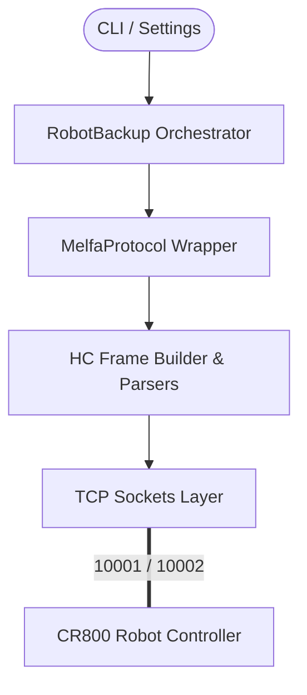

# MELFA Robot Automatic Backup Tool - Software Architecture

This document provides a technical overview of the software components, network protocol architecture, and state machines of the MELFA CR800 Backup Tool.

---

## 1. System Block Diagram

The software is structured in a layered architecture to decouple high-level CLI commands from raw TCP socket communication.



* **Orchestrator (RobotBackup):** Manages the backup lifecycle, parses settings, opens connection sessions, runs directory scans, downloads files, sorts directories, and invokes Git version control.
* **Protocol Wrapper (MelfaProtocol):** Formats plaintext commands and HC-framed commands, validates response checksums, and manages socket buffer accumulation.
* **HC Frame Builder & Parsers:** Translates ASCII payloads into structured frames with bitwise XOR checksums.

---

## 2. Protocol Transition Sequence (Plaintext to HC-Framed)

The client communicates in two phases:
1. **Plaintext Handshake:** Opens the session and changes protocol port framing.
2. **HC-Framed:** Transmits engineering and file transfer commands wrapped in frames.

```mermaid
sequenceDiagram
    autonumber
    participant PC as PC Script
    participant Robot as CR800 Controller (Socket)

    Note over PC, Robot: Phase 1: Plaintext Mode
    PC->>Robot: 1;1;OPEN=TOOLBOX\r\n
    Robot-->>PC: QoK3F;3F;7,0;... (firmware details)
    PC->>Robot: 1;1;CHGPRT=HC\r\n
    Robot-->>PC: QoK\r\n (Switching port driver to HC)

    Note over PC, Robot: Phase 2: HC-Framed Mode (STX/ETX/XOR Checksum)
    PC->>Robot: [STX]HC000000001R00141;1;OPEN=TOOLBOX;ENG[checksum][ETX]
    Robot-->>PC: [STX]HC000000001A000200[checksum][ETX] (Control ACK)
    Robot-->>PC: [STX]HC000000001D0052QoK...[checksum][ETX] (Data Response)
```

---

## 3. Directory Listing Methods (PDIR vs FDIR)

Depending on the `backup.type` setting, the tool uses two different commands to list files:

| Attribute | PDIR Command | FDIR Command |
| :--- | :--- | :--- |
| **Use Case** | Program files (`type: "code"`) | All files or parameters (`type: "full"`, `type: "parameters"`) |
| **Arguments** | `page_hex:02X` (hex suffix) | `page_suffix` + `area` (filter) |
| **Page 0 Suffix**| None (e.g. `PDIR`) | `<` (e.g. `FDIR<*.*`, `FDIR<PRM`) |
| **Page 1+ Suffix**| Hex index (e.g. `PDIR01`, `PDIR0A`) | Zero-padded index (e.g. `FDIR01`, `FDIR010`) |
| **Total Count** | Not returned (loop till empty) | Returned in 4th field (index 3) of page 0 |
| **Extension Filter**| Implicit (only returns `.MB6`) | Explicit (e.g. `*.*` or `PRM`) |

---

## 4. File Downloading State Machine

Downloading a file from the CR800 filesystem uses a strict sequence of commands to lock, retrieve blocks, and unlock:

```mermaid
stateDiagram-v2
    [*] --> Closed
    Closed --> Opened : FOPEN{filename};r
    Opened --> Reading : FREAD{counter:02X}
    Reading --> Reading : FREAD (full 120/240 byte block)
    Reading --> Closing : Partial block returned (< full size)
    Closing --> Quitting : FCLOSE
    Quitting --> Closed : FQUIT
    Closed --> [*]
```



### End-of-File (EOF) Detection
* **First Block:** The downloader dynamically reads the byte length of the first returned block to detect block size (typically 120 or 240 bytes).
* **Terminal Condition:** When a block returned is smaller than the detected block size (e.g., partial block or empty `QoK;1` response), it marks EOF and terminates the sequential loop.

---

## 5. Testing and Simulation Layer

The unit test suite utilizes [mock_robot_server.py](file:///c:/Users/alcz11702216/Documents/Python/Auto%20backup/mock_robot_server.py) running on a background thread.
* **TCP Socket Simulation:** Binds to localhost on a dynamic port (`0`).
* **HC Framing Implementation:** Parses sequences, validates checksums, and sends exact 22-byte Control ACK frames (`A000200`) and Data frames (`D`).
* **Simulated Filesystem:** Pre-populated with program (`.MB6`), parameter (`.PRM`), logs (`.log`, `.evl`), and text (`.txt`) files to verify extension-based subdirectory sorting.
